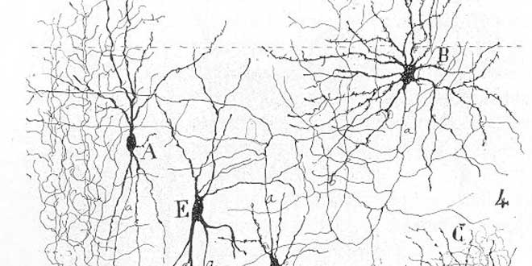
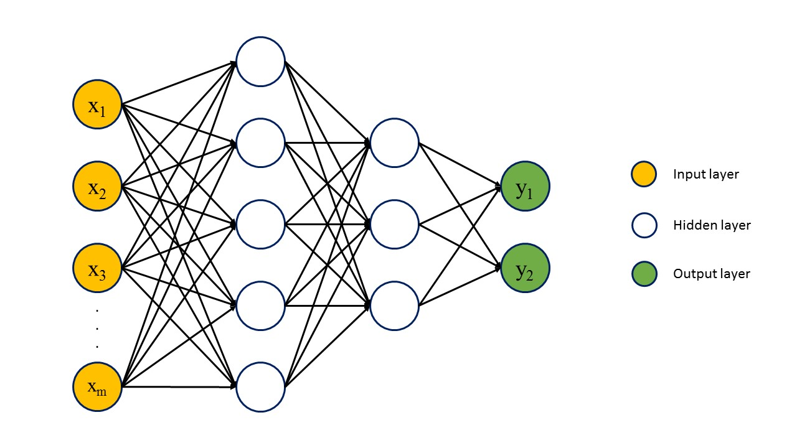
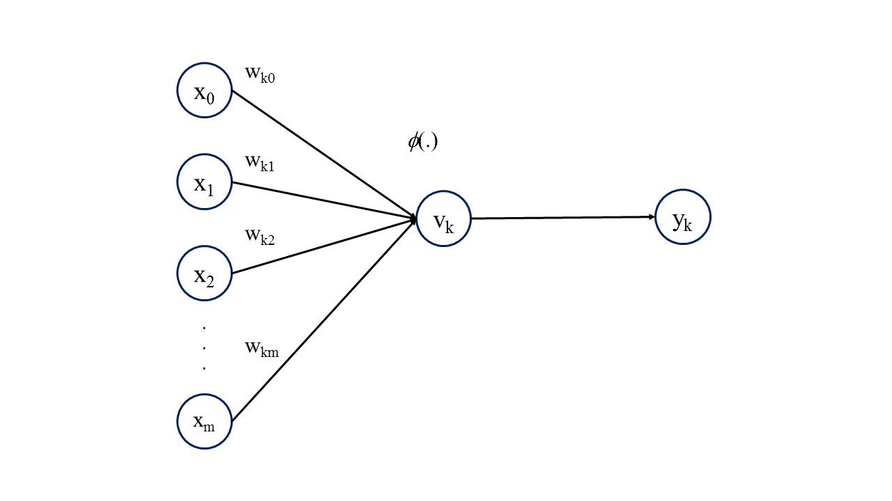
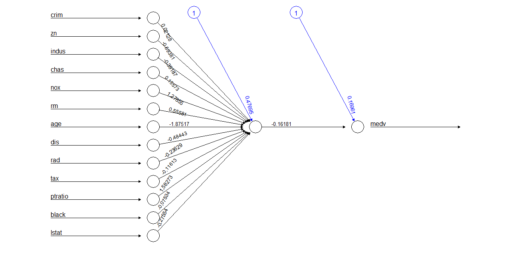
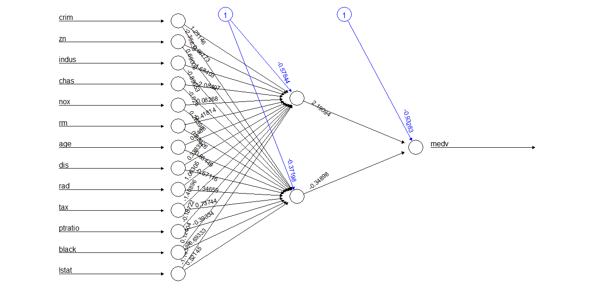

# Introduction

Artificial neural networks (ANN) are a form of machine learning that is based on mimicking the structure of biological brains.

The basic ideas behind artificial neural networks are not new, and date to the early 1940s, when some early models were created. An early nineteenth century theory of the functioning of biological brains, the so-called reticular theory, believed that a nervous system was single continuous organ. Towards the end of the century, this view was challenged with the discovery of the neuron, discrete elements (cells) that formed the nervous system. The work of Spanish scientist Santiago Ramon y Cajal was determinant towards the development of a neural theory of nervous systems. 



Artificial neural networks implement the neuron theory of brain function, by defining neurons as discrete units that process information. Their power comes from the flexible way in which they process information. The objective of this series of seminars is to introduce the fundamentals of artificial neural networks, and to explore their applications in different forms of data analysis.
 
In this session we will cover the following topics.

- Anatomy of a network
- Structure of neurons
- Operation of neural networks
- Learning

Upcoming seminars will cover practical aspects of implementing different forms of artificial neural networks for practical applications.

# Anatomy of a Network

A neural network is a collection of nodes that are linked in such a way that they can process information in a flexible way. Artificial neural networks are a highly abstract and simplified representation of what a biological neural network looks like. While there are possibly thousands of different types of neurons in a human brain, an artificial neural network is built with three different kinds of _neurons_ that are organized in _layers_:

- Input neurons. These neurons constitute the input layer. Think of it as the parts of the nervous system that "perceive" a phenomenon or a pattern.

- Output neurons. These neurons are the last layer of an artificial neural network, and report the results of the the process. They are also the entry point for _backpropagation_ of errors.

- Hidden layer neurons. These neurons are organized in so-called _hidden_ layers, because the values computed there are not observable, unlike those for the input and output layers. Most of the computational process in artificial neural networks happens here.

The connections between neurons are called _synapses_.

An early form of artificial neural network was Rosenblatt's perceptron (c. 1957). The perceptron was a pattern recognition machine built on a single layer of neurons. It was quickly realized that perceptrons were limited in their ability to recognize many classes of patterns, and it was only when multi-layer perceptrons - or feedforward neural networks - were invented, that the field of neural network research started to bloom.

A feedforward neural network is shown in Figure 2.



A neural network has as many neurons in its input layer as covariates are used in the model. For instance, in a risk assessment exercise, a model that aims to categorize a client as likely to default or not based on current balance, age, and education, would have three input neurons, one for each of these three attributes.

The output layer consists of as many neurons as are needed to represent the dependent variable. For instance, a continuous variable, say price, needs only one neuron. As a quantitative variable, the output can be represented by the quantity produced by a single output neuron. A binary variable can also be represented by a single output neuron that produces a value of 0 or 1, or a single quantity for the probability of being in one of these two states. A polytomous dependent variable may need more than one output neuron.

The number of hidden layers, and the number of neurons on each, is arbitrary. There is a vast amount of commentary on the matter [see for instance](ftp://ftp.sas.com/pub/neural/FAQ3.html#A_hl). Additional layers are capable of approximating more complex surfaces, but can also lead to additional local minima and increase the risk that a sub-optimal solution is found. Additional nodes can reduce the training error but lead to overfitting.

There are rules of thumb that say that the number of hidden neurons should be some sort of average between the number of inputs and the number of outputs, although these rules ignore other factors, such as the number of observations, the inherent noise in the data, and how complex the underlying function is.

With respect to the number of layers, one or two layers appear to be appropriate in many applicaitons. Lacking other guidance, the selection of the number of hidden neurones is better made based on experimentation and performance measures.

The power of artificial neural networks is due to the principle of network externalities, since the number of connections grows as a power of the number of neurones. For instance:

- 1 neuron:     0 connections
- 2 neurons:    1 connection
- 3 neurons:    3 connections
- 4 neurons:    6 connections
- ...
- 100 neurons:  4,950 connections

And so on. More generally, the number of connections is $\frac{n(n-1)}{2}$, when $n$ is the number of neurons.

Why are these networks called feedforward? It is beacause of the way information is transmitted, beggining in the input (i.e. perception) layer, and forward towards the output layer. According to the principles of neuronal theory (as opposed to reticular), each neuron is a distinct unit that can and typically will process information in slightly different ways.

# Structure of neurons

The neuron is the basic building block of a neural network.

Although it is conceptualized as a "cell", a neuron in artificial neural networks is in fact a mathematical function. The elements of the neuron are as follows:

- A set of $k+1$ inputs.
For the first hidden layer, the number of inputs is equal to $m+1$, where $m$ is the number of independent variables. For successive layers, the number of inputs is $m_1+1$, where $m_1$ is the number of neurones in the preceding layer. The inputs are transmitted to the neuron via synapses, that is, connections with preceding neurons. Each of these synapses will have associated with it a weight $w_{kj}$. Typically, input $m_0$ is set to the value of $1$. This is called a _bias_ input, and is equivalent to including a constant in linear regression, for example. 

It is important to note at this point that the inputs should be scaled in some way, to ensure that there are not large differences in magnitude among them. Large differences in magnitude - for instance, if one variable ranges between 1,000 and 10,000, while another is in the 0 to 1 range - can lead to problems in the training of the network.

There are several alternatives for scaling the variables. One is to _standardize_ them by centering them on the mean and dividing them by their corresponding standard deviation. Another is to _normalize_ them, by centering each variable on its corresponding minimum value and dividing by its range (maximum minum minimum).

- An activation function
The neuron will have an activation function (also called a transfer function). The role of this function is to process the inputs and weights, in order to produce an output.

In this way, the output of the kth neuron is given by (where $\phi(.)$ is the activation function):

$$
y_k = \phi (\sum_{j=0}^{m}{w_{kj} x_j})
$$

This is illustrated in Figure 3.



As seen in the figure, the neuron aggregates all the inputs, weighted according to their corresponding synapses. 

Before feeding the information forward, the neuron also applies an activation function. There are different activation functions that can be used. The simplest activation function is the identity function:
$$
\phi(x) = x
$$

The identity function does not alter the inputs, and just feeds forward the sum of the weighted inputs. The identity function is used in the case of the neurons in the input layer, with weights set to 1.

Another activation function is the step function, that includes a threshold $T$:

$$
\phi(x) = \left\{
        \begin{array}{ll}
            0 & \quad x \leq T \\
            1 & \quad x > T
        \end{array}
    \right.
$$

This function transforms the inputs, as seen in the following plot(setting $T=0$):
```{r}
x <- seq(-1, 1, 0.01)
fx <- ifelse(x<=0,0,1)
plot(x,fx,type = "l")
```

When would you use this type of function? Think about the outputs, and the dependent variable.

The rectifier function is another stepwise function, given by:

$$
\phi(x) = max(x,T)
$$

This function is as follows, assuming that $T=0$:
```{r}
x <- seq(-1, 1, 0.01)
fx <- ifelse(x<=0,0,x)
plot(x,fx,type = "l")
```

Another alternative is a logistic activation function, defined as:
$$
\phi(x) = \frac{1}{(1+e^{-x})}
$$

Plot this function.
```{r}
x <- seq(-5, 5, 0.01)
fx <- 1/(1+exp(-x))
plot(x,fx,type = "l")
```

When would you use this function?

One additional activation function is the hyperbolic tangent function:

$$
\phi(x) = \frac{1-e^{-2x}}{1+e^{-2x}}
$$

Plot this function.
```{r}
x <- seq(-5, 5, 0.01)
fx <- (1-exp(-2*x))/(1+exp(-2*x))
plot(x,fx,type = "l")
```

Notice how this function produces outputs between $-1$ and $1$.

#Operation of neural networks

Before exploring how artificial neural networks learn, we will examine a simple example to understand the mechanics of their operation. Consider a simple network with only one hidden node and weights as shown in Figure 4.



This network has m=13 inputs, and a bias unit. The activation function for the hidden neuron is the logistic function. The activation function for the input and output neurons is the identity function.

The example is of median housing values. The covariates include crime rates, zoning, concentration of pollutants, age, rooms, and other relevant attributes. Suppose that the values of the covariates are as follows (notice the inclusion of the bias term at the beginning):
```{r}
covariates = c(1.0, 0.46670715977, 0.0, 0.64662756598, 0.0, 0.63374485597, 0.37746694769, 0.84963954686, 0.04344860824, 1.0, 0.91412213740, 0.80851063830, 0.82994603863, 0.70778145695)
```

Note how the values have been normalized and are all in the range between 0 and 1. The actual median property value corresponding to these covariates is $y = 0.0778$ (this value has also been normalized).

The hidden neuron first calculates the weighted sum of the inputs. Given the following weights:
```{r}
weights1 = c(0.47695315623, 0.02128390604, -0.59381438087, -0.39187473267, 0.15572891790, 1.27855120071, 0.55581259774, -1.87517476254, -0.48442985469, -0.23629094710, -0.11612514706,  1.58273314173, -0.07533918773, -0.27554431503)
```

The weighted sum is then:
```{r}
sumWxX1 <- sum(weights1 * covariates)
sumWxX1
```

Before feeding this value forward, the neuron first applies the activation function, which as note above is the logistic function:
```{r}
v1 <- 1/(1+exp(-sumWxX1))
v1
```

The result of applying the activation function is then passed on to the next layer, which in this example is simply the output layer. The output layer will calculate the weighted sum of the inputs, that is, the value fed from the preceding layer, and the corresponding bias term. Given the weights for this layer:
```{r}
weights2 = c(0.169610333, -0.161807703)
```

the weighted sum is calculated as:
```{r}
sumWxX2 = weights2[1] + weights2[2] * v1
sumWxX2
```

Since the activation function for the output neuron is the identity, then the output value is the weighted sume as above. Compare $\hat{y}$ to the actual observed value of $y = 0.0778$.

Note that, had we used an identity activation function in the hidden layer, the output of the network would have been essentially a linear model of the inputs:
$$
\hat{y} = w_{21} + w_{22}(\sum_{j=0}^{m}{w_{1j} x_j})
$$

Consider next the following network now with _two_ hidden neurons. The covariates and dependent variable are the same.


Notice how the synapses corresponding to each hidden neuron have different weights. Each neuron thus is picking up different aspects of the pattern. In this simple example, the output neuron aggregates the results of _two_ different models. Notice again, had we used identity activation functions for the hidden neurons, the output neuron would have produced a weighted sum of the results of two linear models. In a way, the power of artificial neural networks is that they are ensembles of models (think random forests, or bootstrap aggregation in classification and regression trees). This power comes at the cost of interpretability. Since the models are nested and possibly aggregated multiple times, interpretation of the weights as coefficients (for instance, in a regression model), is unfeasible.

# Learning

What is meant by learning in the context of artificial neural networks?

The intuition is simple. Consider a problem to solve, for instance classification, or prediction of a quantitative variable. A class of functions $F$ can be defined that solve the problem - for instance, the functions that define a neural network. Learning essentially means using a set of observations to find a set of functions $f^* \in F$ that solve the problem in some _optimal_ sense.

In order to define optimality some cost function must be defined. In this way, learning entails finding $C(f^*) \leq C(f) \forall f \in F$, that is, the set of functions associated with a cost less than, or at most equal to, any other possible set of functions.

In supervised learning applications, the cost depends on the data. A simple example, appropriate when the dependent variable is quantitative, is the mean squared error:
$$
C = \frac{1}{N}\sum_{i=1}^{N}(f(x_i)-x_i)^2
$$

When the response is categorical, a cost function based on the entropy is appropriate.

A brute force approach to train the network would be to calculate the cost function for different combinations of weights, to then identify the combination of weights that minimizes it. This is in essence a grid search. The idea, although simple, is unfeasible, given the extremely large number of possible combinations.

A different learning approach is needed. 

One possibility is backpropagation. To implement backpropagation, an initial set of weights is defined. The weights could be small values different from $0$. Given a set of $N$ observations, the covariates are fed forward in the network to obtain an estimated value for the dependent variable. This is done for each of the observations. Since the weights are the same, the process is highly amenable to parallelization.

Once that the cost function has been calculated, the contribution of each of the weights/synapses to it can be calculated. This is possible since, as hinted by the preceding examples, a node is a function that depends on the inputs and weights. The weights can then be adjusted in proportion to their gradients. The greater the gradient, the larger the adjustment:
$$
w_{ij}(t +1) = w_{ij}(t) + \eta\frac{\partial C}{\partial w_{ij}} + \xi(t)
$$

where $\eta$ is a parameter that controls the learning rate, and $\xi(t)$ is a random term. Since the cost is a function of embeded functions (given by the activation function) the partial derivative can be obtained by the chain rule.

The operation of backpropagation can be done in batches (for instance, the cost function is calculated based on all the observations), or using a single observation. The advantage of backpropagating based on a single observation at the time, is that this introduces more variability in the learning process, and thus reduces the risk that the algorith will stop at a local minimum.
